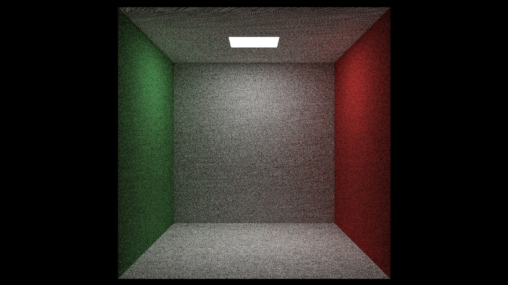

# ray-tracer

[](https://github.com/nicohinze/ray-tracer/actions/workflows/ci.yml)
[](https://raw.githubusercontent.com/nicohinze/ray-tracer/refs/heads/master/LICENSE)

A simple CPU-based ray tracer in C++. It is mostly a toy project to learn about ray tracing.

This project is heavily inspired by:

- [Ray Tracing in One Weekend](https://raytracing.github.io/books/RayTracingInOneWeekend.html)
- [Ray Tracing: The Next Week](https://raytracing.github.io/books/RayTracingTheNextWeek.html)
- [Understandable RayTracing in 256 lines of bare C++](https://github.com/ssloy/tinyraytracer)

## Build

```bash
cmake -S . -B build -G Ninja
cmake --build build
```

## Run


## Example images





